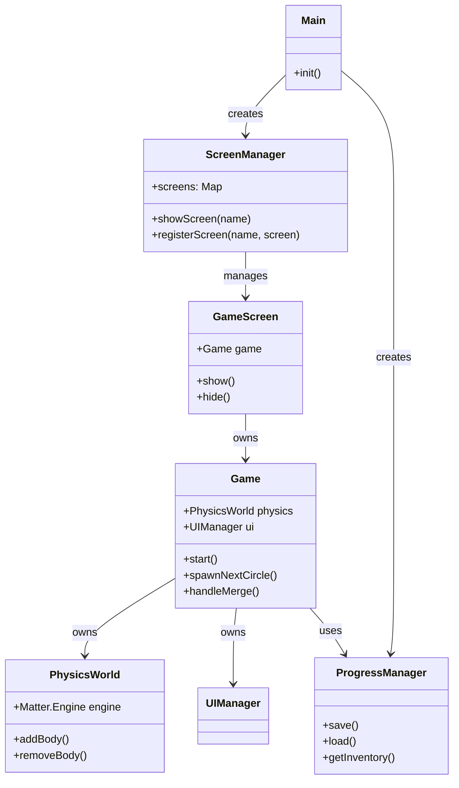

# System Architecture Specification (SystemSpec)

## 1. 아키텍처 개요 (Architecture Overview)
Antigravity 프로젝트는 **Vanilla JavaScript (ES6)**를 기반으로 하며, 외부 의존성을 최소화하여 가볍고 빠른 성능을 지향합니다. 구조는 크게 **Core Game Logic**, **Physics Engine Wrapper**, **UI/Screen Management**, **Data Persistence** 4개의 계층으로 나뉩니다.

## 2. 기술 스택 (Tech Stack)
- **Language**: JavaScript (ES6 Modules)
- **Physics Engine**: `Matter.js` (v0.19.0+) - 2D Rigid Body Physics
- **Rendering**: HTML5 Canvas (Matter.Render) + DOM Overlay (UI)
- **Build Tool**: None (Native ES Modules) or Vite (Optional for dev)
- **Storage**: `localStorage` (JSON serialization)

## 3. 시스템 모듈 상세 (System Modules)

### 3.1 Entry Point (`main.js`)
- 애플리케이션의 진입점.
- `ScreenManager`, `ProgressManager` 등 전역 관리자(Manager) 인스턴스를 생성.
- 화면 크기(`vh` calculation) 및 이벤트 리스너(Resize, Orientation) 초기화.
- 초기 화면(`LobbyScreen`)으로 라우팅.

### 3.2 Game Core (`src/game/`)
게임의 실제 플레이 로직을 담당합니다.
- **`Game.js`**: 게임 루프의 중심. 물리 엔진 이벤트(`collisionStart`, `afterUpdate`)를 구독하여 게임 룰(합체, 점수, 게임오버)을 처리합니다.
- **`PhysicsWorld.js`**: `Matter.Engine`, `Matter.World`, `Matter.Render`를 캡슐화한 래퍼 클래스. Canvas 생성 및 경계벽(`Walls`)을 설정합니다.
- **`Circle.js`**: 물리 객체(과일)를 생성하는 팩토리 클래스. 각 레벨에 맞는 반지름, 텍스처, 물리 속성(탄성, 마찰)을 주입합니다.
- **`Constants.js`**: 게임 밸런싱을 위한 상수 집합 (중력, 마찰 계수, 과일 데이터 등).

### 3.3 UI Architecture (`src/ui/`)
화면 전환과 게임 내 HUD를 관리합니다.
- **`ScreenManager.js`**: SPA(Single Page Application)처럼 `Map<String, Screen>`을 관리하며, 화면(`div`)의 `display` 속성을 제어하여 화면을 전환합니다.
- **`UIManager.js`**: `Game` 클래스 내부에서 사용되며, 점수 갱신, 다음 과일 미리보기, 파티클 이펙트 생성 등 실시간 게임 UI를 갱신합니다.
- **Screen Classes**: `TitleScreen`, `LobbyScreen`, `GameScreen`, `AchievementScreen`, `StoryScreen` 등 각 화면별 로직을 분리하여 구현합니다.

### 3.4 Data & Persistence (`src/managers/`, `src/data/`)
- **`ProgressManager.js`**: 유저의 진행 상황(최고 점수, 인벤토리, 해금된 스토리 등)을 `localStorage`에 저장하고 불러옵니다.
- **Data Files**: `StoryData.js`, `AchievementData.js` 등 정적 콘텐츠 데이터를 관리합니다.

## 4. 물리 엔진 설정 (Physics Configuration)
- **Engine**: `Matter.Engine.create()`
- **Runner**: `Matter.Runner.create()` (Fixed timestep 권장)
- **Gravity**: `y: 1` (기본 중력)
- **Boundaries**: 화면 좌/우/하단에 `isStatic: true`인 사각형 바디 배치. 상단은 개방되어 있으나 논리적 데드라인 존재.
- **Rendering**: `Matter.Render`를 사용하여 Canvas에 직접 그리기. 디버그 모드(`wireframes: true`)와 릴리즈 모드(Sprite 렌더링) 지원.

## 5. 클래스 다이어그램 (Class Diagram)

## 6. 데이터 흐름 (Data Flow)
1. **Input**: 유저 터치/클릭 -> `Game.js` Event Listener.
2. **Process**: `Game.js` -> `PhysicsWorld` (Add Body / Apply Force).
3. **Event**: `Matter.Events` (Collision) -> `Game.js` (Merge Logic).
4. **Update**: `Game.js` -> `UIManager` (Score Update) -> DOM/Canvas.
5. **Persistence**: `Game.js` (Level Clear) -> `ProgressManager` -> `localStorage`.
